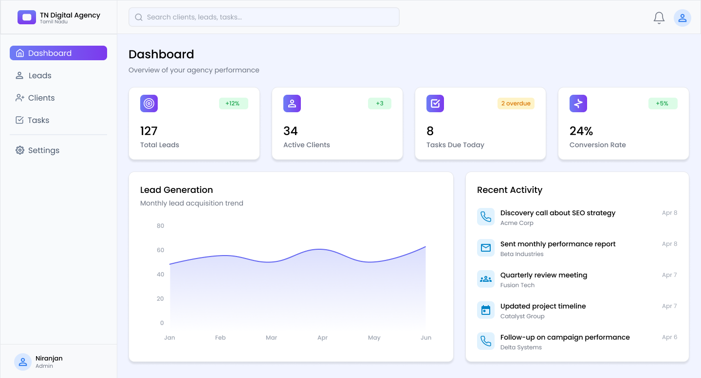
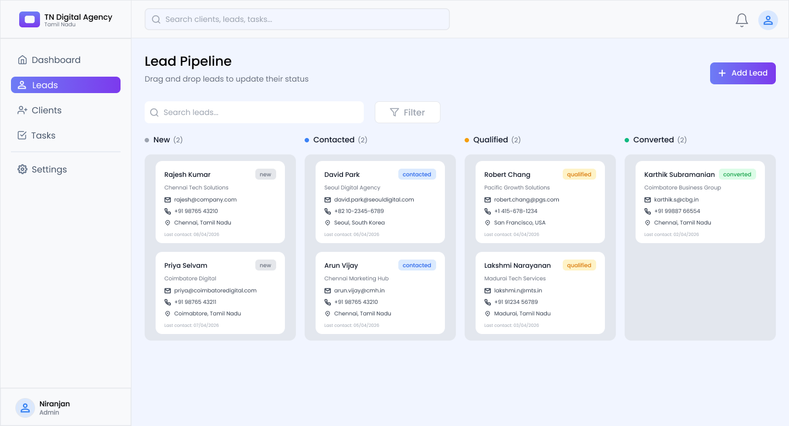
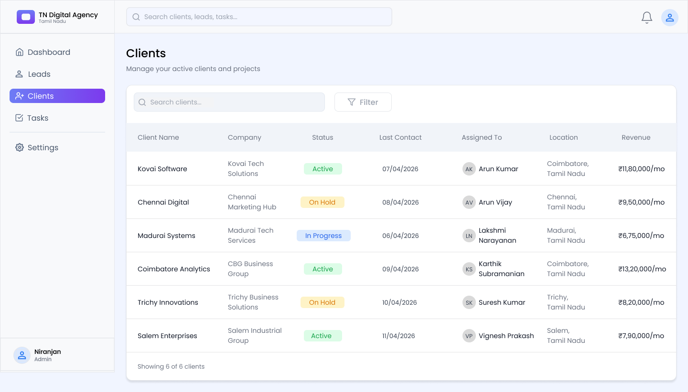
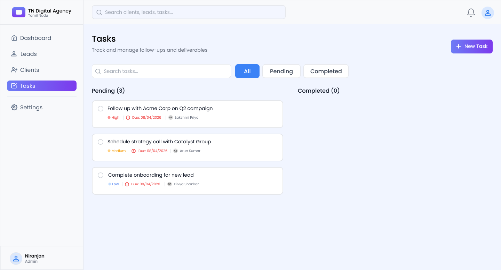
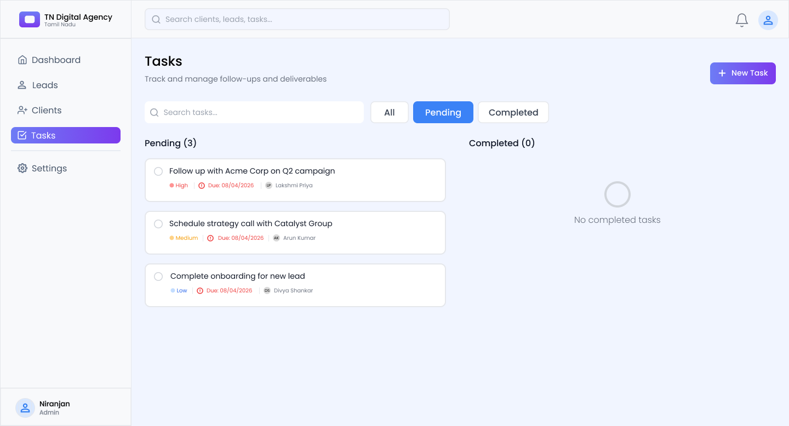
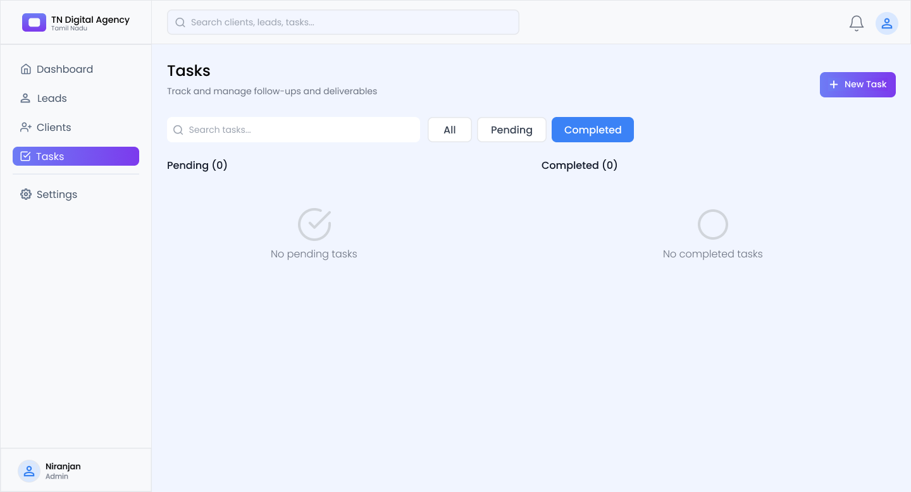
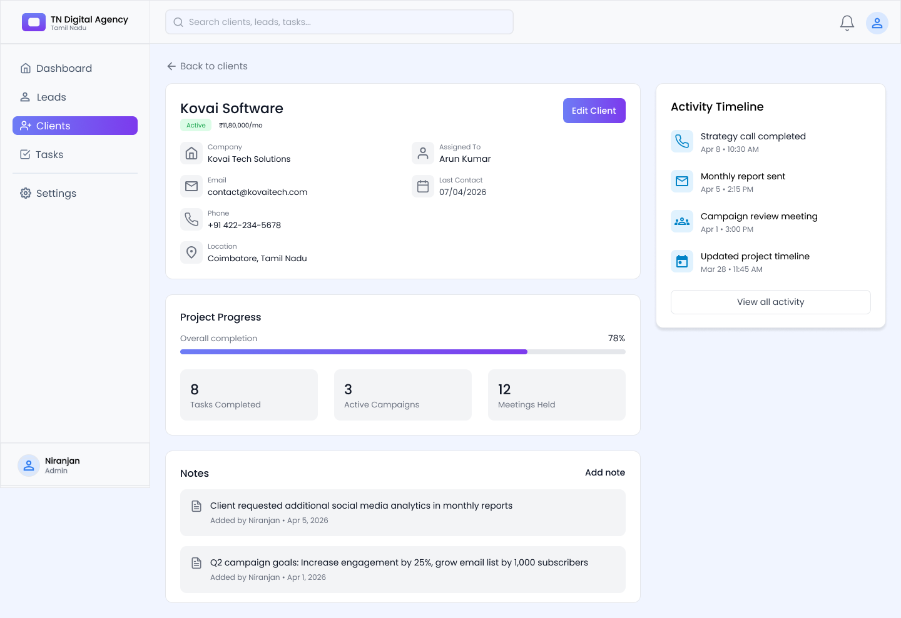
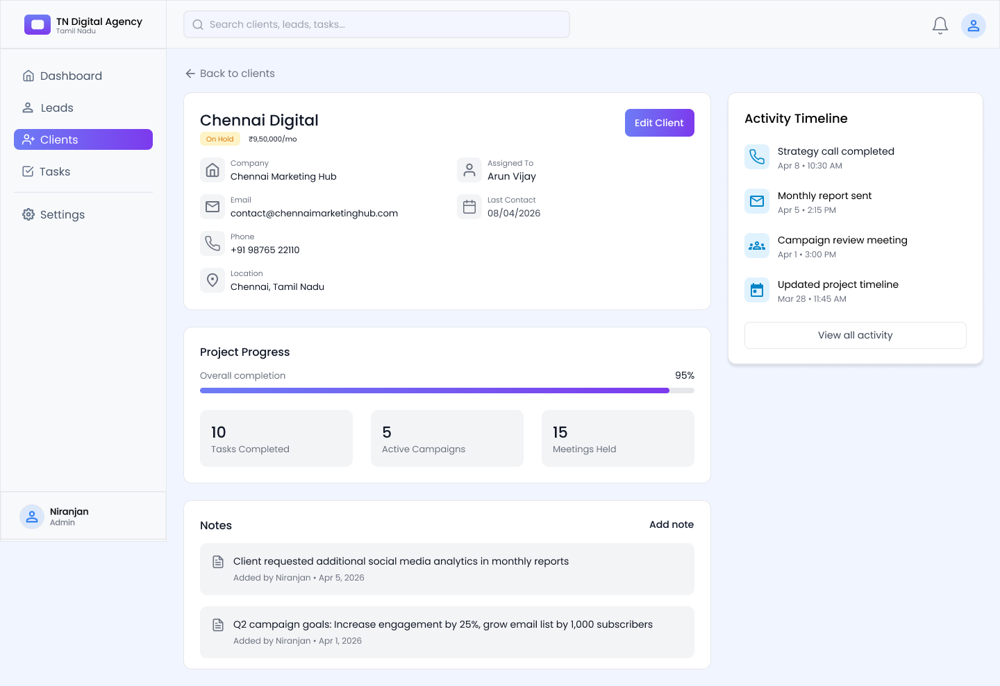
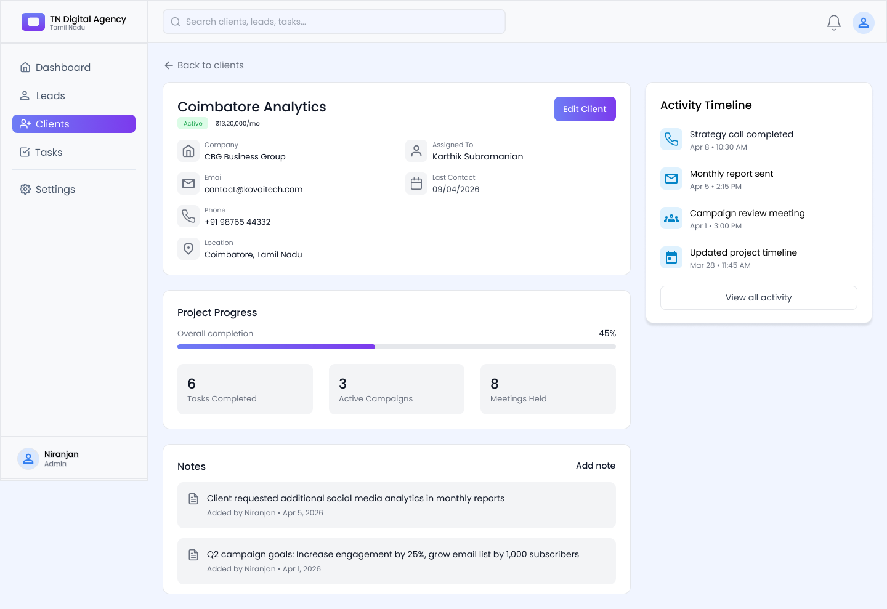
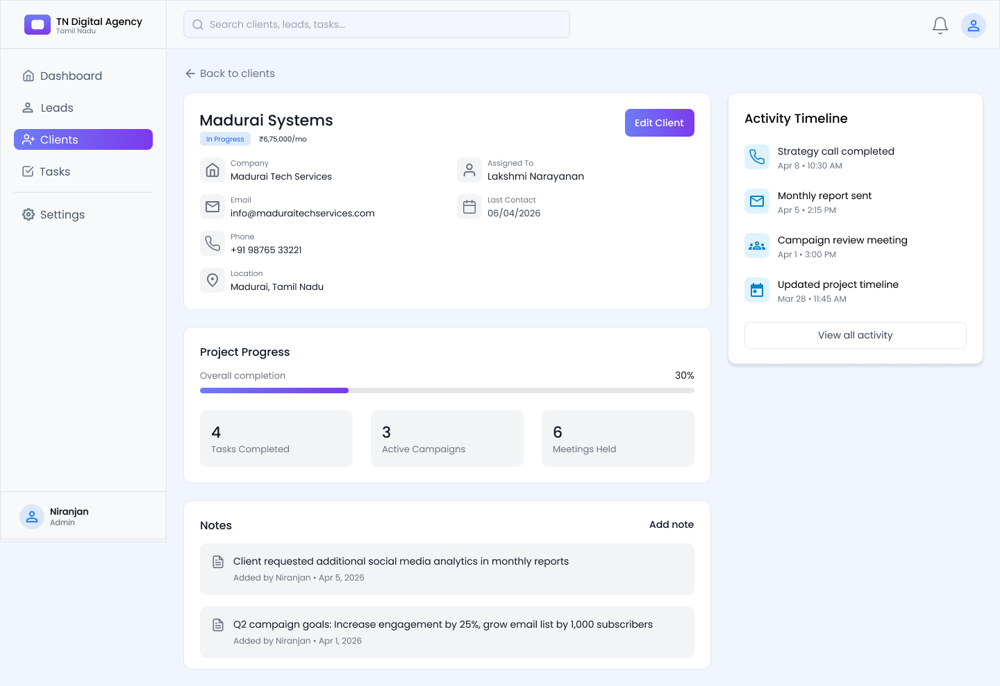

# CRM Dashboard UI/UX Design (Task 03)

## 📌 Overview
This project is part of the Future Intern UI/UX Design track (UX).  
The project focuses on designing a modern CRM dashboard for managing clients, leads, tasks, and business insights.

The designed platform is branded as **TN Digital Agency**, providing a clean and efficient interface for day-to-day operations.

---

## 🎯 Objective
To design a user-friendly CRM dashboard that helps users:
- Manage client information
- Track leads and conversions
- Monitor tasks and progress
- View business analytics in a clear format

---

## ✨ Features
- Dashboard with analytics overview
- Leads management interface
- Client management system
- Task tracking (Pending & Completed)
- Graph visualization for insights
- Clean and modern UI design

---

## 🎨 Design Style
- Soft **purple-gray background theme**
- **Gradient-based highlights** for active elements
- Minimal and clean **card-based layout**
- Consistent spacing and alignment
- Focus on readability and usability

---

## 🛠 Tools Used
- Figma (UI/UX Design & Prototyping)

---

## 🔗 Figma Design Link
https://www.figma.com/design/1eCg4gZWweaCf6H1A6tjxf/CRM?node-id=2-2&t=uN7sfdynYtnENOM2-1

---

## 🎥 Figma Prototype Link
https://www.figma.com/proto/1eCg4gZWweaCf6H1A6tjxf/CRM?node-id=2-2&t=uN7sfdynYtnENOM2-1

---

## 📷 Screens

### Dashboard

### Leads

### Clients

### Tasks

### Pending Tasks

### Completed Tasks

### Client Details

